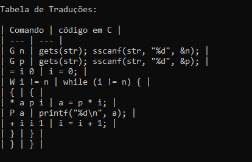

# Projeto B: Compiladores CEUB

#### Alunos: 
- Lucas Zoser Nunes Costa (RA: `22105593`)
- Leonardo Benttes Almeida Placido dos Santos (RA: `22103833`)


## Introdução

Este guia descreve a implementação de um compilador para a linguagem de programação LPS1. O projeto é dividido em duas partes principais:

1.  Analisador léxico e sintático mais a geração de código em C.
2.  Analisador léxico e sintático mais a construção da Árvore Sintática Abstrata (ASA).

O objetivo é criar um compilador que converta programas escritos em LPS1 para a linguagem C. A LPS1 é uma linguagem simples onde todas as palavras-chave são letras maiúsculas e as variáveis são letras minúsculas, automaticamente declaradas como inteiros.

## Estrutura dos Arquivos

### main.py

O arquivo `main.py` é responsável por coletar o código LPS1 do usuário e invocar o analisador para processá-lo e gerar o código C correspondente.

#### Código:

```python
import subprocess
import sys

def main():
    print("Digite o código LPS1. Pressione Enter em uma linha vazia para finalizar a entrada.")

    pseudo_codigo = []
    while True:
        linha = input()
        if linha.strip() == "":
            break
        pseudo_codigo.append(linha)
    
    pseudo_codigo = "\n".join(pseudo_codigo)

    if pseudo_codigo:
        process = subprocess.Popen(
            [sys.executable, "analisadores.py"],
            stdin=subprocess.PIPE,
            stdout=subprocess.PIPE,
            stderr=subprocess.PIPE,
        )
        stdout, stderr = process.communicate(input=pseudo_codigo.encode('latin1'))
        print(stdout.decode('latin1'))
        if stderr:
            print(stderr.decode('latin1'), file=sys.stderr)

    else:
        print("Insira o código para prosseguir")

if __name__ == "__main__":
    main()
``` 

#### Explicação:

1.  **Entrada do Código LPS1:** Coleta linhas de código LPS1 do usuário até que uma linha vazia seja inserida.
2.  **Subprocesso:** Inicia um subprocesso para executar o arquivo `analisadores.py`, passando o código LPS1 coletado.
3.  **Comunicação com o Subprocesso:** Envia o código LPS1 ao subprocesso e imprime a saída gerada pelo analisador.

### analisadores.py

O arquivo `analisadores.py` contém o analisador léxico e sintático para LPS1 e gera o código C correspondente.

#### Código:

```python

import re
import sys

# Gramática da linguagem: LPS1
LPS1 = {
    'G': r'\bG\b',
    'P': r'\bP\b',
    'W': r'\bW\b',
    'I': r'\bI\b',
    '=': r'=',
    '+': r'\+',
    '-': r'-',
    '*': r'\*',
    '/': r'/',
    '%': r'%',
    '#': r'#',
    '<': r'<',
    'VARIABLE': r'\b[a-z]\b',
    'NUMBER': r'\b\d+\b',  # Permitir números com mais de um dígito
    '{': r'\{',
    '}': r'\}',
    'WHITESPACE': r'\s+',
    'UNKNOWN': r'.'
}

class Token:
    def __init__(self, type, value):
        self.type = type
        self.value = value

    def __repr__(self):
        return f"Token({self.type}, {self.value})"

def convertToken(code):
    tokens = []
    indice = 0
    while indice < len(code):
        match = None
        for token_type, regex in LPS1.items():
            pattern = re.compile(regex)
            match = pattern.match(code, indice)
            if match:
                if token_type != 'WHITESPACE':
                    tokens.append(Token(token_type, match.group(0)))
                indice = match.end(0)
                break
        if not match:
            tokens.append(Token('UNKNOWN', code[indice]))
            indice += 1
    return tokens

class Parser:
    def __init__(self, tokens):
        self.tokens = tokens
        self.current_token = None
        self.commands = []
        self.proximo_token()
        self.c_code = []

    def proximo_token(self):
        if self.tokens:
            self.current_token = self.tokens.pop(0)
        else:
            self.current_token = None

    def parse(self):
        self.c_code.append("#include <stdio.h>")
        self.c_code.append("int main() {")
        self.c_code.append("int a, b, c, d, e, f, g, h, i, j, k, l, m, n, o, p, q, r, s, t, u, w, x, y, z;")
        self.c_code.append('char str[512];')
        self.parse_commands()
        self.c_code.append("return 0;")
        self.c_code.append("}")

        return "\n".join(self.c_code)

    def parse_commands(self):
        while self.current_token and self.current_token.type != '}':
            self.parse_command()

    def parse_command(self):
        if self.current_token.type == 'G':
            self.parse_get_command()
        elif self.current_token.type == '=':
            self.parse_assign_command()
        elif self.current_token.type == '+':
            self.parse_add_command()
        elif self.current_token.type == '-':
            self.parse_sub_command()
        elif self.current_token.type == '*':
            self.parse_mult_command()
        elif self.current_token.type == '/':
            self.parse_div_command()
        elif self.current_token.type == '%':
            self.parse_mod_command()
        elif self.current_token.type == 'P':
            self.parse_print_command()
        elif self.current_token.type == 'W':
            self.parse_while_command()
        elif self.current_token.type == 'I':
            self.parse_if_command()
        elif self.current_token.type == '{':
            self.parse_composite_command()
        else:
            raise SyntaxError(f"Unexpected token: {self.current_token}")

    def parse_get_command(self):
        self.proximo_token()  # Skip 'G'
        variable = self.current_token.value
        self.c_code.append(f'gets(str); sscanf(str, "%d", &{variable});')
        self.commands.append((f'G {variable}', f'gets(str); sscanf(str, "%d", &{variable});'))
        self.proximo_token()

    def parse_assign_command(self):
        self.proximo_token()  # Skip '='
        var = self.current_token.value
        self.proximo_token()
        val = self.current_token.value
        self.c_code.append(f'{var} = {val};')
        self.commands.append((f'= {var} {val}', f'{var} = {val};'))
        self.proximo_token()

    def parse_add_command(self):
        self.proximo_token()  # Skip '+'
        var = self.current_token.value
        self.proximo_token()
        val1 = self.current_token.value
        self.proximo_token()
        val2 = self.current_token.value
        self.c_code.append(f'{var} = {val1} + {val2};')
        self.commands.append((f'+ {var} {val1} {val2}', f'{var} = {val1} + {val2};'))
        self.proximo_token()

    def parse_sub_command(self):
        self.proximo_token()  # Skip '-'
        var = self.current_token.value
        self.proximo_token()
        val1 = self.current_token.value
        self.proximo_token()
        val2 = self.current_token.value
        self.c_code.append(f'{var} = {val1} - {val2};')
        self.commands.append((f'- {var} {val1} {val2}', f'{var} = {val1} - {val2};'))
        self.proximo_token()

    def parse_mult_command(self):
        self.proximo_token()  # Skip '*'
        var = self.current_token.value
        self.proximo_token()
        val1 = self.current_token.value
        self.proximo_token()
        val2 = self.current_token.value
        self.c_code.append(f'{var} = {val1} * {val2};')
        self.commands.append((f'* {var} {val1} {val2}', f'{var} = {val1} * {val2};'))
        self.proximo_token()

    def parse_div_command(self):
        self.proximo_token()  # Skip '/'
        var = self.current_token.value
        self.proximo_token()
        val1 = self.current_token.value
        self.proximo_token()
        val2 = self.current_token.value
        self.c_code.append(f'{var} = {val1} / {val2};')
        self.commands.append((f'/ {var} {val1} {val2}', f'{var} = {val1} / {val2};'))
        self.proximo_token()

    def parse_mod_command(self):
        self.proximo_token()  # Skip '%'
        var = self.current_token.value
        self.proximo_token()
        val1 = self.current_token.value
        self.proximo_token()
        val2 = self.current_token.value
        self.c_code.append(f'{var} = {val1} % {val2};')
        self.commands.append((f'% {var} {val1} {val2}', f'{var} = {val1} % {val2};'))
        self.proximo_token()

    def parse_print_command(self):
        self.proximo_token()  # Skip 'P'
        val = self.current_token.value
        self.c_code.append(f'printf("%d\\n", {val});')
        self.commands.append((f'P {val}', f'printf("%d\\n", {val});'))
        self.proximo_token()

    def parse_while_command(self):
        self.proximo_token()  # Skip 'W'
        condition = self.parse_comparison()
        self.c_code.append(f'while ({condition}) {{')
        self.commands.append((f'W {condition}', f'while ({condition}) {{'))
        self.parse_commands()
        self.c_code.append('}')
        self.commands.append(('}', '}'))

    def parse_if_command(self):
        self.proximo_token()  # Skip 'I'
        condition = self.parse_comparison()
        self.c_code.append(f'if ({condition}) {{')
        self.commands.append((f'I {condition}', f'if ({condition}) {{'))
        self.parse_commands()
        self.c_code.append('}')
        self.commands.append(('}', '}'))

    def parse_composite_command(self):
        self.proximo_token()  # Skip '{'
        self.commands.append(('{', '{'))
        self.parse_commands()
        self.proximo_token()  # Skip '}'
        self.commands.append(('}', '}'))

    def parse_comparison(self):
        var = self.current_token.value
        self.proximo_token()
        operator = self.current_token.value
        self.proximo_token()
        val = self.current_token.value
        self.proximo_token()
        op_map = {'=': '==', '#': '!=', '<': '<'}
        return f'{var} {op_map[operator]} {val}'

def generate_table(commands):
    table = "| Comando | código em C |\n"
    table += "| --- | --- |\n"
    for command, c_code in commands:
        table += f"| {command} | {c_code} |\n"
    return table

if __name__ == "__main__":
    pseudo_codigo = sys.stdin.read()
    tokens = convertToken(pseudo_codigo)
    parser = Parser(tokens)
    codigo_c_traduzido = parser.parse()
    table = generate_table(parser.commands)

    print(codigo_c_traduzido)
    print("\nTabela de Traduções:\n")
    print(table)` 
```
#### Explicação:

1.  **Analisador Léxico:** Define a gramática da linguagem LPS1 e converte o código de entrada em tokens.
2.  **Classe `Token`:** Representa um token com um tipo e um valor.
3.  **Função `convertToken`:** Converte o código LPS1 em uma lista de tokens usando expressões regulares.
4.  **Classe `Parser`:** Analisa os tokens e gera o código C correspondente.
5.  **Métodos de Parsing:** Cada método (`parse_get_command`, `parse_assign_command`, etc.) lida com um tipo específico de comando na LPS1 e gera o código C equivalente.
6.  **Função `generate_table`:** Gera uma tabela que mapeia os comandos LPS1 para o código C gerado.

## Conceitos Relacionados de Compiladores

### Análise Léxica

A análise léxica é o primeiro estágio do processo de compilação. Ela transforma a sequência de caracteres de entrada em uma sequência de tokens. Cada token representa um símbolo atômico da linguagem, como palavras-chave, operadores ou identificadores.

### Análise Sintática

A análise sintática recebe a sequência de tokens da análise léxica e verifica se eles seguem a estrutura gramatical da linguagem. Esse processo constrói uma árvore sintática ou estrutura de dados similar que representa a hierarquia das construções da linguagem.

### Geração de Código

A geração de código é a etapa onde a árvore sintática ou as estruturas intermediárias são convertidas em código de máquina ou em outra linguagem de alto nível, como C. No contexto deste projeto, os comandos da LPS1 são convertidos para C diretamente durante a análise sintática.

### Árvore Sintática Abstrata (ASA)

A ASA é uma representação intermediária do código fonte que abstrai detalhes de sintaxe e foca na estrutura lógica do código. Ela é útil para otimizações e para facilitar a geração de código em diferentes etapas da compilação.

## Exemplo de Uso

### Entrada em LPS1

```plaintext

G n
G p
= i 0
W i # n {
  * a p i
  P a
  + i i 1
}
``` 

### Saída em C

```c
#include <stdio.h>
int main() {
    int a, b, c, d, e, f, g, h, i, j, k, l, m, n, o, p, q, r, s, t, u, w, x, y, z;
    char str[512];
    gets(str); sscanf(str, "%d", &n);
    gets(str); sscanf(str, "%d", &p);
    i = 0;
    while (i != n) {
        a = p * i;
        printf("%d\n", a);
        i = i + 1;
    }
    return 0;
}
``` 

### Tabela de Traduções




## Conclusão do trabalho

Este guia cobriu a implementação de um compilador simples para a linguagem LPS1, detalhando a análise léxica e sintática, bem como a geração de código em C. Através deste projeto, conceitos fundamentais de compiladores, como análise léxica, análise sintática, e geração de código, foram explorados e implementados.